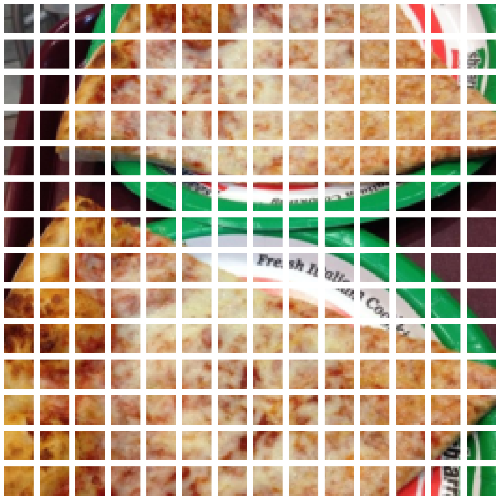

# Vision Transformer (ViT)  
Implementation and experiments based on the [*An Image is Worth 16x16 Words*](https://arxiv.org/abs/2010.11929) paper.  

## 🔹 Overview
The Vision Transformer (ViT) treats an image as a sequence of patches and applies a standard Transformer encoder directly for classification.  

**Input to a vision transformer**

```
x_input = [class_token, image_patch_1, image_patch_2,.....,image_patch_n] + 
[class_token_pos, image_patch_1_pos,........,image_patch_n_pos]
```

__Example Patched Image__

This is the 16x16 patched image that passes onto the multiheaded attention layer


## 🔹 Model Architecture
- Patch size: **16×16**  
- Embedding dimension: **768**  
- Attention heads: **6**  
- Encoder depth: **12 layers**  
- Feedforward dimension: **3072**  
- Dropout: **0.1** 


## 🔹 Hyperparameters
| Parameter             | Value  |
|------------------------|--------|
| Optimizer             | AdamW |
| Base Learning Rate    | 1e-4 |
| Scheduler             | Cosine Annealing|
| Batch Size            | 32   |
| Weight Decay          | 0.05  |
| Epochs                | 100   |

---

## 🔹 Training Setup
- **Dataset:** Food-101-mini
- **Image Size:** 224×224  
- **Patch Size:** 16  
- **Hardware:** NVIDIA 4090 (laptop)
- **Frameworks:** PyTorch, Torchvision  

## 🔹 Metrics & Results
### 📉 Training & Validation Loss  
 